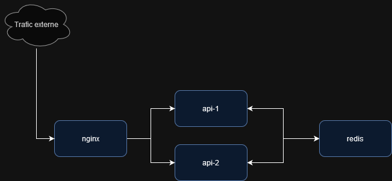
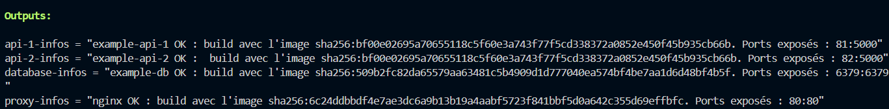
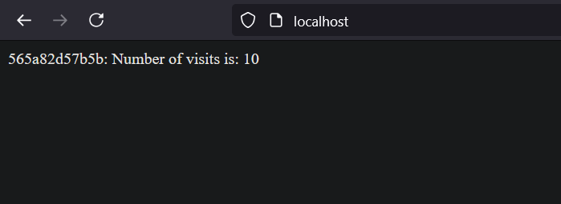

# Exercice :

## Prérequis

Avant de commencer, prenez tout d'abord soin de lancer la commande à la racine du projet :

```Bash
terraform init
```

## Structure du projet

```txt
tree
.
├── .gitignore
├── .terraform.lock.hcl
├── api.tf
├── database.tf
├── LICENSE
├── network.tf
├── nginx.tf
├── NOTICE.md
├── outputs.tf
├── README.md
├── variables.tf
├── versions.tf
├── img
│   ├── ...
├── nginx
│   ├── Dockerfile
│   └── nginx.conf
└── web
    ├── Dockerfile
    ├── package-lock.json
    ├── package.json
    └── server.js

3 directories, 12 files

```

## Objectif

L'objectif final est que votre application, déjà fonctionnelle, s'exécute et puisse être contactée sur le point d'entrée : ` http://localhost `.

Votre infrastructure finale ressemblera à ça :



## Exercice 1 - Ecriture des images

Pour commencer, nous allons nous concentrer sur 3 fichiers à compléter :

- [Les deux instances d'api](api.tf) : sera build à partir d'un dockerfile local, se trouvant [ici](./web/Dockerfile).
- [La base de données](database.tf) : cette dernière fonctionnera sous l'image [redis](https://hub.docker.com/_/redis).
- [Le loadbalancer](nginx.tf) : ce dernier fonctionnera sur une image custom nginx. Vous trouverez le dockerfile tout prêt [ici](./proxy/Dockerfile), *aucun besoin de modifier la configuration*.

Ces trois sont composés chacun de deux ressources :

- Une docker image qui représente l'image à pull ou toutes les instructions relatives au build.
- Un ou plusieurs containers pour lancer les applications.

Pour se faire, vous aurez besoin de ces deux pages de référence qui vous aideront :

- [Documentation des images par terraform](https://registry.terraform.io/providers/kreuzwerker/docker/latest/docs/resources/container)
- [Documentation des conteneurs par terraform](https://registry.terraform.io/providers/kreuzwerker/docker/latest/docs/resources/image)

De plus, vous aurez probablement besoin de ces deux fonctions pour l'api. Un exemple sera présent dans le code pour vous aider :

- https://developer.hashicorp.com/terraform/language/functions/index_function
- https://developer.hashicorp.com/terraform/language/meta-arguments/for_each

**L'objectif final est d'exécuter une run terraform qui vous transmet toutes les informations de chaque image.**

```Bash
terraform apply
```



Mais vous constatez que la connexion au localhost ne fonctionne pas encore malgré que les services semblent tourner si on entre la commande :

```bash
docker ps
```

## Exercice 2 - Mise en réseau

Vous l'avez constaté, mais les conteneurs ne semblent que démarrer en boucle encore et encore. C'est parce que l'application se base sur des noms de domaines en interne qui ne sont pas définit par le réseau de docker.

Nous devons donc agir sur le réseau, et nous concentrer sur le [dernier fichier](./network.tf). Mais aussi faire des mises à jour sur les pods pour permettre que :

- L'api soit identifiée sur le réseau par `web1` pour l'api 1 et `web2` pour l'api 2.
- La base de données soit identifiée sous le nom de `redis`.

Pour se faire, vous aurez besoin de deux ressources :

- [Les réseau docker](https://registry.terraform.io/providers/kreuzwerker/docker/latest/docs/resources/network)
- [La gestion de domaines interne sur conteneur](https://registry.terraform.io/providers/kreuzwerker/docker/latest/docs/resources/container#nestedblock--host)

**L'objectif final est d'exécuter une run terraform qui vous transmet toutes les informations de chaque image.**

```Bash
terraform apply
```



## Pour aller plus loin

L'exercice vous a plu ? Vous avez compris les bases de terraform ?
Peut-être que le challenge sur la branche `From-Scratch`peut vous intéresser. Il remet l'exercice sans aucune indications, mais en poussant plus loin pour maîtriser des aspects plus avancés de docker.
